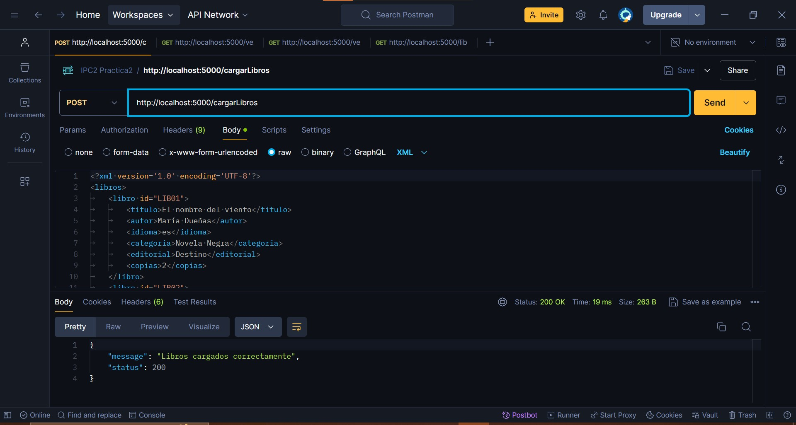
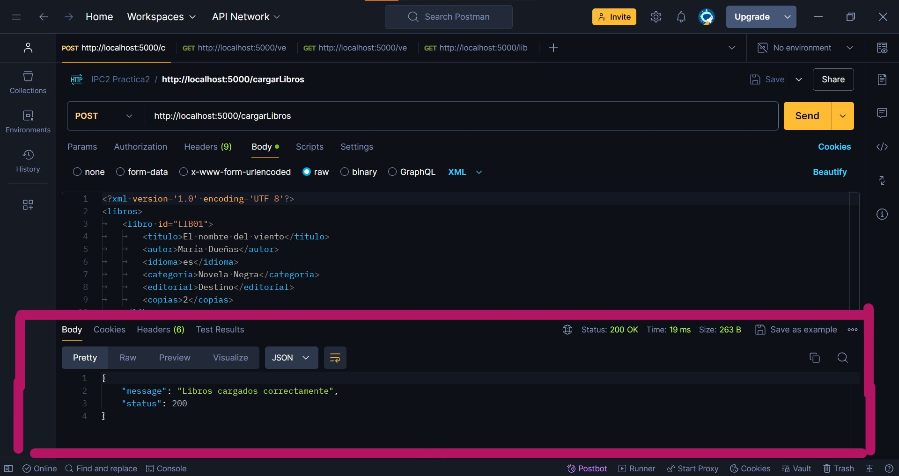
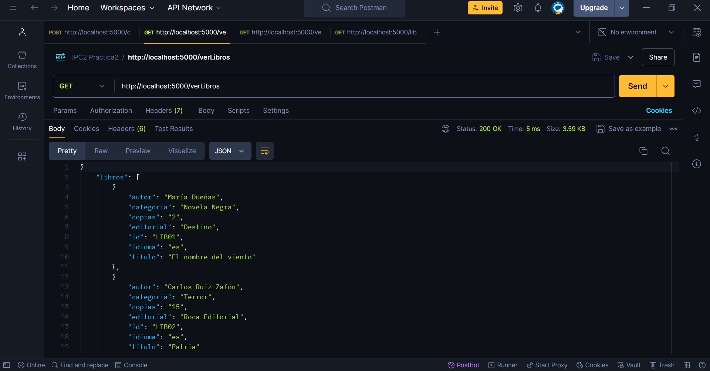

# IPC2_Practica2VJ_201701010

API para gestionar una biblioteca virtual utilizando Flask y XML para el almacenamiento de datos.

## Descripción

En esta práctica 2 se trata de una aplicación que permite cargar, visualizar y filtrar libros utilizando endpoints RESTful. Los datos de los libros se almacenan en archivos XML y se gestionan mediante operaciones CRUD básicas.

Para probar la funcionalidad de la práctica se hizo uso de la aplicación de postman

## Funcionalidades
### Antes que nada
En VisualStudio Code, en la terminal, ubicarse en la carpeta donde se encuentra el archivo 'main.py' y escribir "py main.py" para que comience a funcionar.

### Cargar Libros desde XML

- **Endpoint**: `/cargarLibros`
- **Método**: POST
- **Descripción**: Permite cargar libros desde un archivo XML en el sistema.
- **Ejemplo de Uso**: 
1. Colocar en Postman `http://localhost:5000/cargarLibros`
2. Ir a la pestaña de "Body" y seleccionar la opción "raw" (verificar que esté activada la opción de "XML")
3. Escribir la información de los libros en formato XML
4. Verificar que esté "POST" y darle a send

El Resultado se puede ver así con un mensaje de que se cargó correctamente el archivo:

****
### Ver Todos los Libros
- **Endpoint:** `/verLibros`
- **Método:** GET
- **Descripción:** Devuelve la lista completa de libros almacenados en formato JSON.
- **Ejemplo de uso:**
1. Colocar en Postman `http://localhost:5000/verLibros`
2. Verificar que esté "GET" y darle a send

Verificar que haya un archivo cargado antes de presionar send 
****

### Ver Libro por ID en XML
### Ver Todos los Libros
- **Endpoint:** `/verLibro/<id_libro>`
- **Método:** GET
- **Descripción:** Devuelve los detalles de un libro específico en formato XML según su ID
- **Ejemplo de uso:**
1. Colocar en Postman `http://localhost:5000/verLibro/<id_libro>`
2. En "<libro_id>" asegurarse de colocar un ID que exista en el archivo que se cargó