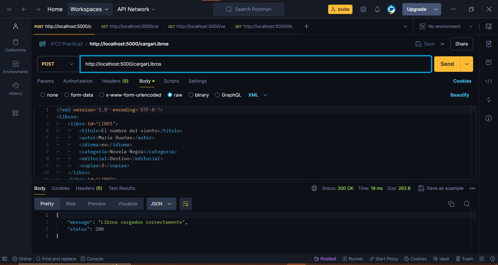
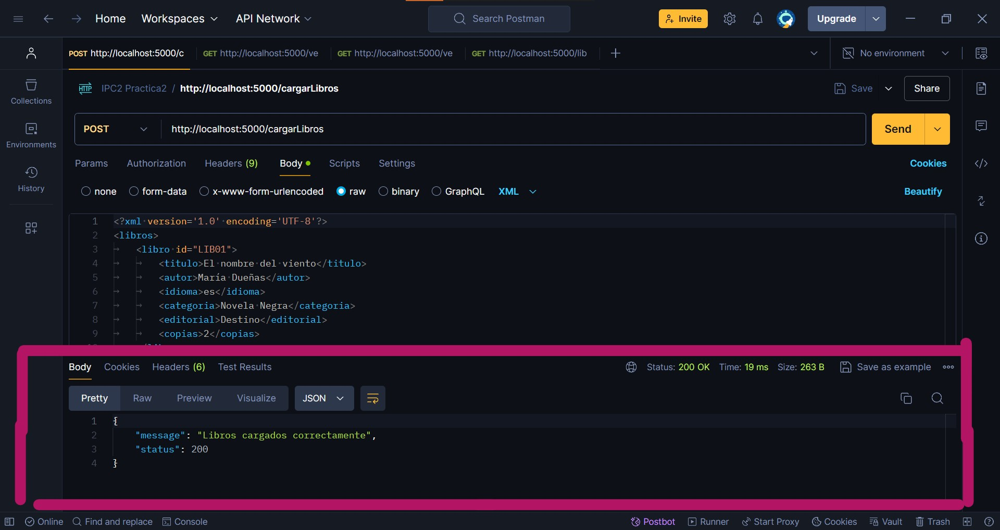
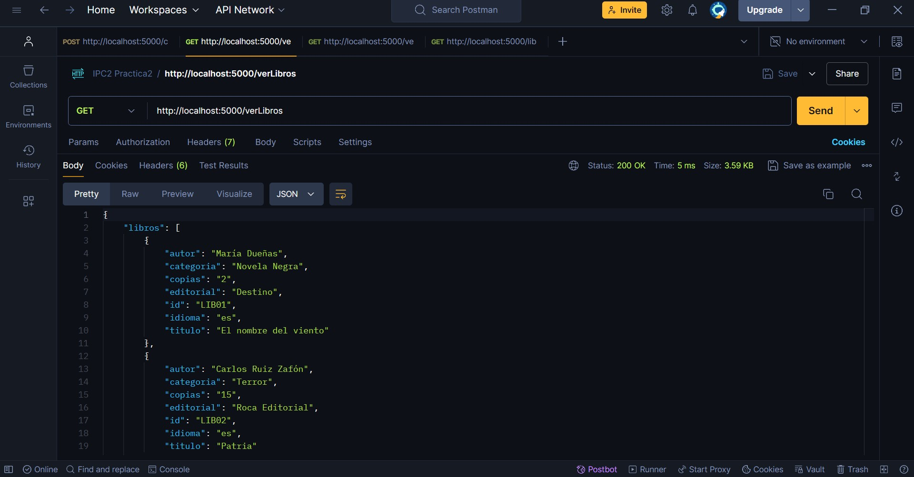
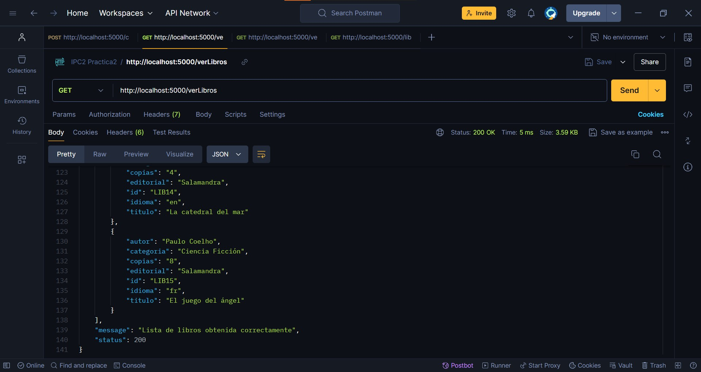
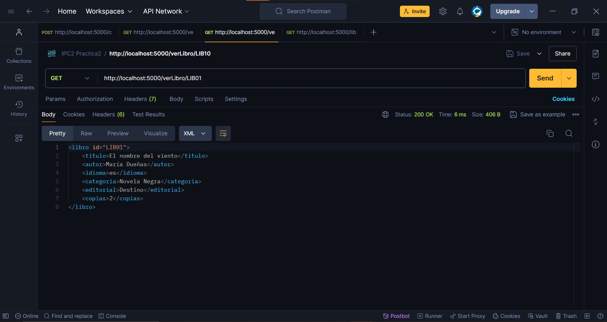
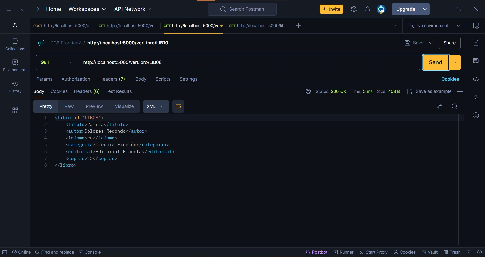
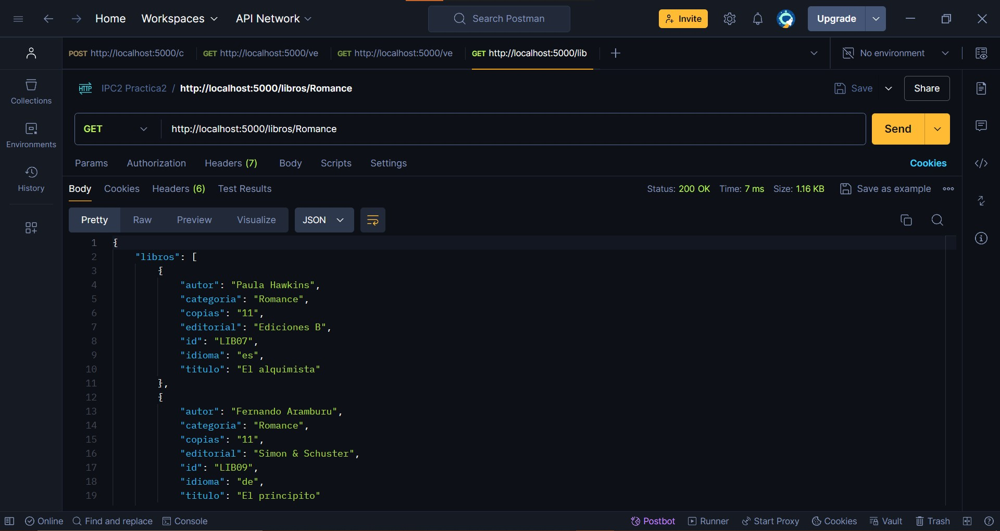
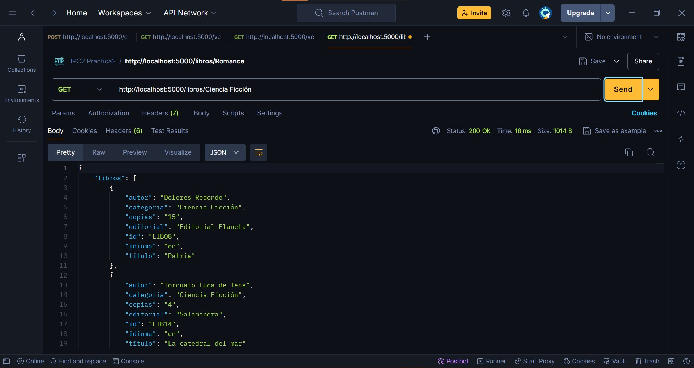
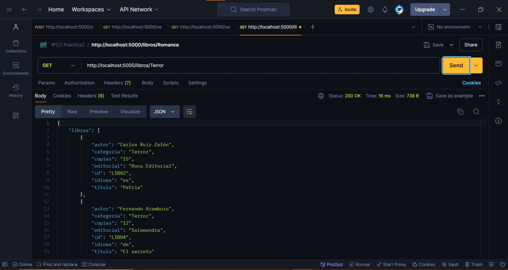

# IPC2_Practica2VJ_201701010

API para gestionar una biblioteca virtual utilizando Flask y XML para el almacenamiento de datos.

## Descripción

En esta práctica 2 se trata de una aplicación que permite cargar, visualizar y filtrar libros utilizando endpoints RESTful. Los datos de los libros se almacenan en archivos XML y se gestionan mediante operaciones CRUD básicas.

Para probar la funcionalidad de la práctica se hizo uso de la aplicación de postman

## Funcionalidades
### Antes que nada
En VisualStudio Code, en la terminal, ubicarse en la carpeta donde se encuentra el archivo 'main.py' y escribir "py main.py" para que comience a funcionar.

### Cargar Libros desde XML

- **Endpoint**: `/cargarLibros`
- **Método**: POST
- **Descripción**: Permite cargar libros desde un archivo XML en el sistema.
- **Ejemplo de Uso**: 
1. Colocar en Postman `http://localhost:5000/cargarLibros`
2. Ir a la pestaña de "Body" y seleccionar la opción "raw" (verificar que esté activada la opción de "XML")
3. Escribir la información de los libros en formato XML
4. Verificar que esté "POST" y darle clic a send



El Resultado se puede ver así con un mensaje de que se cargó correctamente el archivo:


****
### Ver Todos los Libros
- **Endpoint:** `/verLibros`
- **Método:** GET
- **Descripción:** Devuelve la lista completa de libros almacenados en formato JSON.
- **Ejemplo de uso:**
1. Colocar en Postman `http://localhost:5000/verLibros`
2. Verificar que esté "GET" y darle clic a send




Verificar que haya un archivo cargado antes de presionar send 
****

### Ver Libro por ID en XML
### Ver Todos los Libros
- **Endpoint:** `/verLibro/<id_libro>`
- **Método:** GET
- **Descripción:** Devuelve los detalles de un libro específico en formato XML según su ID
- **Ejemplo de uso:**
1. Colocar en Postman `http://localhost:5000/verLibro/<id_libro>`
2. En "<libro_id>" asegurarse de colocar un ID que exista en el archivo que se cargó
3. Verificar que esté "GET" y darle clic a send





****
### Filtrar Libros por Categoría en JSON

- **Endpoint**: `/libros/<categoria_libro>`
- **Método:** GET
- **Descripción**: Filtra y devuelve los libros que pertenecen a una categoría específica en formato JSON.
- **Ejemplo de uso:**
1. Colocar en Postman `http://localhost:5000/verLibro/<categoria_libro>`
2. En "<libro_id>" asegurarse de colocar una categoría que exista en el archivo que se cargó
3. Verificar que esté "GET" y darle clic a send





## Errores y Estado

A continuación se detallan los posibles errores y sus correspondientes códigos de estado que la API puede devolver:

### 404 Not Found

- **Error al cargar los libros**: El XML está vacío o hubo un problema al procesarlo.

  **Respuesta**:
    ```json
    {
      "message": "Error al cargar los libros: El XML está vacío",
      "status": 404
    }
    ```

- **No hay libros disponibles**: La lista de libros está vacía.

  **Respuesta**:
    ```json
    {
      "libros": [],
      "message": "No hay libros disponibles",
      "status": 404
    }
    ```

- **Libro no encontrado**: No se encontró un libro con el ID especificado.

  **Respuesta**:
    ```json
    {
      "message": "Libro no encontrado",
      "status": 404
    }
    ```

- **No hay libros disponibles en la categoría especificada**: No se encontraron libros en la categoría dada.

  **Respuesta**:
    ```json
    {
      "libros": [],
      "message": "No hay libros disponibles en la categoría \"Informatica\"",
      "status": 404
    }
    ```

### 500 Internal Server Error

- **Error al obtener la lista de libros**: Ocurrió un error inesperado al intentar obtener la lista de libros.

  **Respuesta**:

    ```json
    {
      "message": "Error al obtener la lista de libros: [descripción del error]",
      "status": 500
    }
    ```

- **Error al obtener el libro**: Ocurrió un error inesperado al intentar obtener un libro por ID.

  **Respuesta**:
    ```json
    {
      "message": "Error al obtener el libro: [descripción del error]",
      "status": 500
    }
    ```

- **Error al obtener la lista de libros por categoría**: Ocurrió un error inesperado al intentar filtrar los libro


## Información del desarrollador
- **Nombre: Bryant Herrera Rubio**
- **Enlace del repositorio: https://github.com/bryanthr6/IPC2_Practica2VJ_201701010**
- **Carnet de Universidad: 201701010**


Este es un ejemplo básico y puedes adaptarlo según la estructura y detalles específicos de tu proyecto. Si necesitas ajustes o tienes más preguntas, consultar con el desarrollador.

